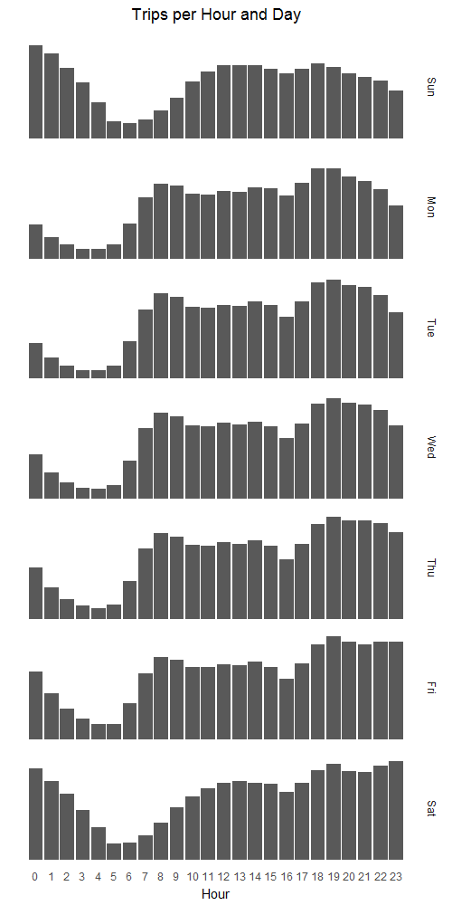
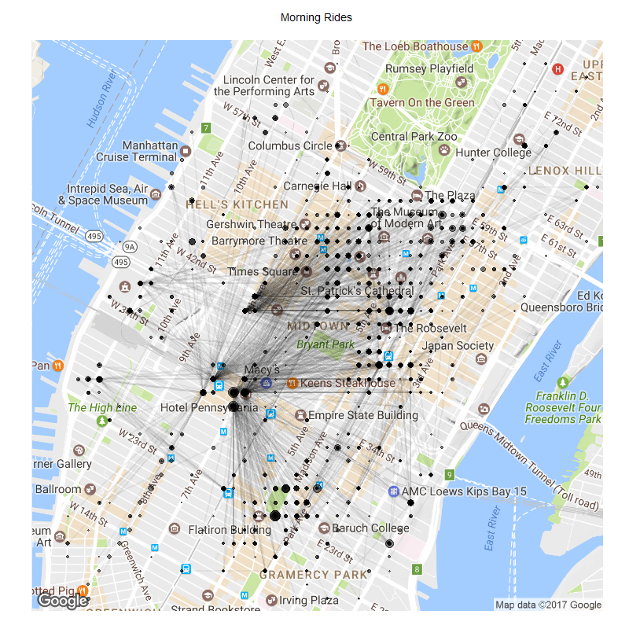
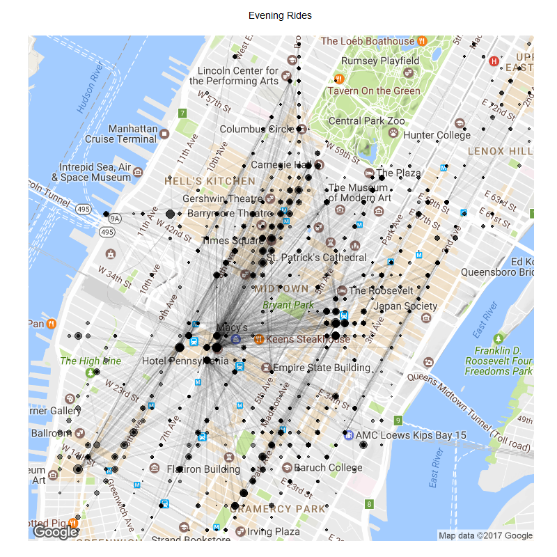

#Task 1

```{r, echo=F, warning=F}
suppressMessages(library(dplyr))
library(ggplot2)

#Task 1
d1 <- read.csv("task1data.csv")

task1graph <- d1 %>%
  ggplot(aes(hour,freq)) +
  geom_bar(stat="identity") +
  facet_grid(weekday~., labeller = as_labeller(c(`1` = "Sun", `2` = "Mon", `3` = "Tue", `4` = "Wed", `5` = "Thu", `6` = "Fri", `7` = "Sat"))) +
  ggtitle("Trips per Hour and Day") +
  scale_x_continuous("Hour", breaks=seq(0,23, by=1)) +
  theme(axis.ticks.y = element_blank(),
        axis.title.y = element_blank(),
        axis.text.y = element_blank(),
        axis.ticks.x = element_blank(),
        strip.background = element_blank(),
        panel.background = element_blank(),
        plot.title = element_text(hjust=.5))

ggsave("Task1.png", task1graph, width = 5, height = 10, dpi=100)
```



#Task 2

```{r, echo=F, warning=F}
d2 <- read.csv("task2data.csv")

d2$rider_mil <- d2$rider_mil/1000000

d2 %>%
  ggplot(aes(year,rider_mil)) +
  geom_line() +
  facet_wrap(~month, labeller = as_labeller(c(`1` = "01 Jan", `2` = "02 Feb", `3` = "03 Mar", `4` = "04 Apr", `5` = "05 May", `6` = "06 Jun", `7` = "07 Jul", `8` = "08 Aug", `9` = "09 Sep", `10` = "10 Oct", `11` = "11 Nov", `12` = "12 Dec"))) +
  scale_x_continuous("Year") +
  scale_y_continuous("Total Passengers (millions)") +
  ggtitle("Yearly Passenger Trends by Month") +
  theme_bw() +
  theme(plot.title = element_text(hjust=.5),
        strip.background = element_blank(),
        panel.border = element_blank())
  
```

#Task 3

```{r, echo=F, warning=F}
d3 <- read.csv("task3data.csv")

d3 %>%
  filter(avg_dist > 2.5, avg_dist<3.5) %>%
  ggplot(aes(avg_dist)) +
  geom_histogram(binwidth = 0.05, breaks=seq(2.5, 3.5, by = 0.05)) +
  facet_grid(year~.) +
  scale_y_continuous("Frequency") + 
  scale_x_continuous("Miles Travelled") +
  ggtitle("Distance per Trip per Year") +
  theme(axis.ticks.y = element_blank(),
        axis.text.y = element_blank(),
        plot.title = element_text(hjust=.5),
        panel.background = element_blank(),
        strip.background = element_blank())

```

#Task 4

```{r, echo=F, warning=F}
d4 <- read.csv("task4data.csv")

d4 %>%
  ggplot(aes(year, tot_amt/1000000)) +
  geom_bar(stat="identity") +
  scale_x_continuous("Year", breaks=c(2009,2010,2011,2012,2013,2014,2015)) +
  scale_y_continuous("Total Fares (millions)") +
  theme_bw() +
  theme(panel.border = element_blank(),
        plot.title = element_text(hjust=.5)) +
  ggtitle("Total Fares by Year")
```

#Tasks 5 and 6

```{r, echo=F, warning=F}
suppressMessages(library(ggmap))
dmap <- read.csv("task5and6data.csv") %>%
  filter(pickup_long> -74.01, pickup_long < -73.95, pickup_lat< 40.775, pickup_lat>40.734 )

d5 <- dmap %>%
  filter(time_of_day=="morning",total>300)

d6 <- dmap %>%
  filter(time_of_day == "evening", total>300)

suppressMessages(nyc <- get_map("Midtown Manhattan", zoom=14))

mornmap <- ggmap(nyc) +
  geom_point(data=d5, aes(x=pickup_long, y=pickup_lat, size=total), alpha = 0.5) +
  geom_point(data=d5, aes(x=dropoff_long, y=dropoff_lat, size=total), alpha = 0.5) +
  scale_size(range=c(0,2)) +
  geom_segment(data = d5, aes(x=pickup_long, y=pickup_lat, xend=dropoff_long, yend=dropoff_lat), alpha = 0.05) +
  ggtitle("Morning Rides") +
  theme(axis.ticks = element_blank(),
        axis.text = element_blank(),
        plot.title = element_text(size=5, hjust=0.5),
        axis.title = element_blank(),
        plot.background = element_blank(),
        legend.position = "none")

evemap <- ggmap(nyc) +
  geom_point(data=d6, aes(x=pickup_long, y=pickup_lat, size=total), alpha = 0.5) +
  geom_point(data=d6, aes(x=dropoff_long, y=dropoff_lat, size=total), alpha = 0.5) +
  scale_size(range=c(0,2)) +
  geom_segment(data = d6, aes(x=pickup_long, y=pickup_lat, xend=dropoff_long, yend=dropoff_lat), alpha = 0.05)  +
  ggtitle("Evening Rides") +
  theme(axis.ticks = element_blank(),
        axis.text = element_blank(),
        plot.title = element_text(size=5, hjust=0.5),
        axis.title = element_blank(),
        plot.background = element_blank(),
        legend.position = "none")
  
ggsave("Morning.png", mornmap, width = 4, height = 4, dpi = 200)
ggsave("Evening.png", evemap, width = 4, height = 4, dpi = 200)
```



